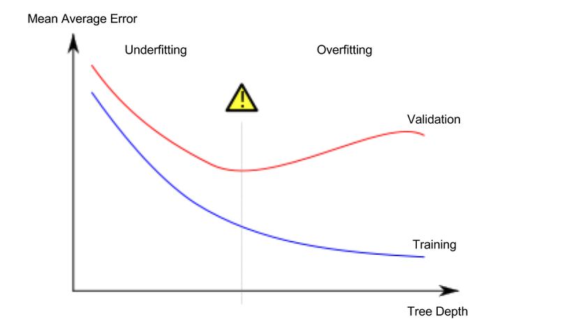

#Faster Data Science Education

Practical data skills you can apply immediately: that's what you'll learn in these free micro-courses.

They're the fastest (and most fun) way to become a data scientist or improve your current skills.
 
